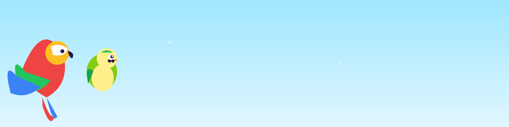

<!-- Animated parrot & budgie header — works perfectly because it's a separate .svg file -->

# 🪶 **Hi, I'm Dirk!**

### Parrot enjoyer • Budgie admirer • Builder of beautiful things

I craft tools, chase elegant ideas, and always try to leave the timeline a little brighter than I found it. 🦜

## 🧰 **Tech Stack**

 

## 🌟 **Featured Project → [Luminary](https://github.com/bccsa/luminary)**

My current passion project — come say hi!

 

## 🌿 **Thanks for visiting!**

May your branches always be sturdy, your seeds find good soil, and your merges stay conflict-free. 🦜✨

